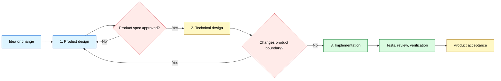

<div align="center">

# 🔥 GrillPowers

*Clarify first. Build with discipline. Finish with evidence.*

[](LICENSE)


<table>
<tr><td align="left">
Product requirements and technical requirements get mixed into one conversation.<br>
Non-technical users are pulled into implementation choices they cannot evaluate.<br>
Every technical branch can reopen scope, so requirements grow instead of converging.
</td></tr>
</table>

**GrillPowers separates product design, technical design, and implementation so the user can stay in the product-manager role from idea to acceptance.**

`Idea → product design → technical design → implementation → verification → product acceptance`

<a href="#why">Why</a> ·
<a href="#install">Install</a> ·
<a href="#workflow">Workflow</a> ·
<a href="#usage">Usage</a> ·
<a href="#example">Example</a> ·
<a href="#structure">Structure</a>

[**English**](README.md) · [**简体中文**](docs/lang/README_ZH.md)

</div>

---

<a id="why"></a>

## 🎯 Why GrillPowers exists

GrillPowers began with a practical goal: combine the most useful parts of Grill Me and Superpowers, then remove the interaction patterns that create role confusion or scope drift for a non-technical product manager.

- **Grill Me contributes product focus.** It inspects existing facts, asks one meaningful product question at a time, recommends a direction, and waits for explicit confirmation.
- **Superpowers contributes engineering discipline.** Planning, test-driven implementation, systematic debugging, review ownership, and fresh verification all make delivery more reliable.

Used directly in product-facing work, Superpowers often discusses product requirements and technical requirements in the same thread. A user without an engineering background can be pulled into architecture choices they cannot evaluate. Each new technical option can reopen the product boundary, making the requirement set larger and harder to converge.

GrillPowers keeps the strengths of both systems and introduces three hard stage boundaries:

| Pain | GrillPowers solution | Advantage |
|---|---|---|
| Product and technical questions are discussed together. | Finish and approve product design before technical design begins. | Scope converges around product value and acceptance criteria. |
| The user is expected to answer implementation questions. | The agent owns architecture, data, interfaces, tests, and task planning. | The user only needs to act as the product manager. |
| Technical possibilities repeatedly expand the requirement set. | Any technical choice that changes behavior, scope, cost, or risk returns to product design for a deliberate decision. | Technical work cannot silently enlarge the product. |

<a id="modes"></a>

## 🧩 Choose an installation mode

| Mode | Best for | What happens |
|---|---|---|
| **Managed isolated install** | A clean, reproducible setup | The installer fetches both upstreams at locked commits, installs the GrillPowers bridge, and exposes only the selected skills. |
| **Manual integration** | A machine that already manages Matt Pocock Skills or Superpowers | Keep the existing upstream directories, add `skills/grill-powers`, and mirror the selection in `config/skill-selection.json`. |

The managed installer performs a preflight check and stops when a target already exists. It prints its intended paths in dry-run mode and does not silently replace an installation.

<a id="systems"></a>

## ✨ Three stages, one product-manager role

| Stage | User role | Agent responsibility | Exit condition |
|---|---|---|---|
| **1. Product design** | Define the audience, value, scope, business rules, and acceptance criteria. | Inspect facts, ask one product decision at a time, recommend a direction, and write the product specification. | The user approves the product specification. |
| **2. Technical design** | Decide only trade-offs that change product behavior, scope, cost, or risk. | Translate the approved product into architecture, data, interfaces, test strategy, and an implementation plan. | The design covers every acceptance criterion without changing the approved product boundary. |
| **3. Implementation** | Review the observable product result and accept or reject it. | Implement, test, debug, review, and run fresh verification. | Evidence supports the result and the user completes product acceptance. |

The user only needs to be the product manager: decide what should exist, who it serves, where the boundary sits, and what counts as done. GrillPowers owns the technical path from the approved product design to verified implementation.

<a id="workflow"></a>

## 🗺 Workflow



The user participates at the product-design and product-acceptance points. Technical design and implementation stay agent-owned. When a technical discovery would change the approved product boundary, the workflow pauses and returns the decision to the product manager.

<a id="managed"></a>

## 📦 What GrillPowers manages

### Installed components

- One original orchestration skill: `skills/grill-powers`
- Matt Pocock Skills pinned to `9603c1cc8118d08bc1b3bf34cf714f62178dea3b`
- Superpowers v6.1.1 pinned to `d884ae04edebef577e82ff7c4e143debd0bbec99`
- One user-facing GrillPowers entrypoint over a curated set of pinned upstream methods

### Working artifacts

- An approved product specification with testable acceptance criteria
- An agent-owned technical design and implementation plan traced back to the product specification
- Code and tests produced by one delivery owner
- Review findings, fresh verification evidence, and product acceptance

GrillPowers keeps these artifacts in the user's project. This repository contains the workflow definition, installation metadata, and fictional examples only.

<a id="install"></a>

## ⚡ Install

### Requirements

- Windows PowerShell 5.1 or newer
- Git
- Codex skill discovery through a local skills directory

### Managed install

Run the dry check first:

```powershell
Set-ExecutionPolicy -Scope Process Bypass
.\scripts\install.ps1 -WhatIf
```

Review the printed paths, then install and verify:

```powershell
.\scripts\install.ps1
.\scripts\verify.ps1
```

Both scripts accept `-InstallRoot` and `-DiscoveryRoot` for isolated or test installations. The installer also accepts `-MattSourceRoot` and `-SuperpowersSourceRoot` when clean local checkouts already exist at the locked commits.

### Manual integration

If both upstream projects are already installed and versioned by another system:

1. Copy `skills/grill-powers` into the host's skill directory.
2. Keep the upstream namespaces and complete skill directories intact.
3. Expose the entries listed in `config/skill-selection.json`.
4. Confirm that `to-spec` hands off to `superpowers:writing-plans`.
5. Run the skill validator from the host environment.

### Repository regression

Maintainers can exercise dry-run, conflict refusal, isolated installation, routing, and tamper detection with two clean checkouts at the locked commits:

```powershell
.\scripts\test-install.ps1 `
  -MattSourceRoot C:\path\to\mattpocock-skills `
  -SuperpowersSourceRoot C:\path\to\superpowers
```

The suite creates a unique operating-system temp directory and limits cleanup to that test root.

<a id="usage"></a>

## 🚀 Usage

Start with a real product idea, request, or change:

```text
Use $grill-powers to take saved-search sharing from an unresolved idea through verified delivery.
```

Expect this interaction contract:

1. Describe the product goal in product language.
2. GrillPowers inspects available facts and asks one product decision at a time, with a recommendation.
3. Approve the product design and its acceptance criteria.
4. GrillPowers completes the technical design and implementation plan. It returns only choices that change product behavior, scope, cost, or risk.
5. GrillPowers implements, tests, debugs, reviews, and verifies the result.
6. Review the observable product and complete product acceptance.

You remain the product manager throughout the workflow. GrillPowers preserves your product decisions as the contract for all technical work.

<a id="principles"></a>

## 🛡 Operating principles

1. **Product design comes first.** Technical possibilities cannot define the product boundary by accident.
2. **One product decision at a time.** Recommendations make each choice understandable and convergent.
3. **The user stays in the product-manager role.** Architecture, data, interfaces, tests, and task planning belong to the agent.
4. **Technical design follows the approved product.** It must trace back to product rules and acceptance criteria.
5. **Product-impacting changes loop back.** Behavior, scope, cost, or risk changes require a deliberate product decision.
6. **Implementation ends with evidence and acceptance.** Fresh checks support the technical result; the user accepts the product result.

<a id="example"></a>

## 🎬 Example: Saved Search Links

The initial request is deliberately incomplete:

> Let users share a saved search. We need it quickly.

During product design, GrillPowers resolves the choices that change the product:

- Who may create and open a link?
- Does access require an account?
- Can the owner revoke it?
- Does it expire?
- What should an invalid or unauthorized visitor see?

After the user approves those answers, GrillPowers freezes the product boundary. During technical design, the agent chooses the data model, interfaces, permission checks, test strategy, and implementation plan. It asks the user only when a technical constraint changes the product experience, cost, risk, or scope. During implementation, the agent builds and verifies the feature; the user reviews the resulting product behavior.

See the complete fictional artifact chain:

- [Initial request](examples/INPUT.md)
- [Approved specification](examples/SPEC.md)
- [Implementation plan](examples/IMPLEMENTATION-PLAN.md)
- [Verification record](examples/VERIFICATION.md)

<a id="structure"></a>

## 📂 Project structure

```text
grill-powers/
├── README.md
├── LICENSE
├── THIRD_PARTY_NOTICES.md
├── config/
│   ├── sources.lock.json
│   └── skill-selection.json
├── docs/
│   └── lang/
│       └── README_ZH.md
├── examples/
│   ├── INPUT.md
│   ├── SPEC.md
│   ├── IMPLEMENTATION-PLAN.md
│   └── VERIFICATION.md
├── LICENSES/
│   ├── mattpocock-skills-MIT.txt
│   └── superpowers-MIT.txt
├── scripts/
│   ├── install.ps1
│   ├── verify.ps1
│   └── test-install.ps1
└── skills/
    └── grill-powers/
        ├── SKILL.md
        ├── LICENSE
        ├── THIRD_PARTY_NOTICES.md
        ├── LICENSES/
        │   ├── mattpocock-skills-MIT.txt
        │   └── superpowers-MIT.txt
        ├── agents/
        │   └── openai.yaml
        └── references/
            └── handoff-contract.md
```

<a id="notes"></a>

## 📌 Notes

- v1 ships a tested Windows PowerShell installer. Manual integration remains available for other hosts.
- Source commits and the selected discovery surface are data files under `config/`, so upgrades are explicit and reviewable.
- The upstream projects remain in their own namespaces and retain their complete directory structure.
- The installer does not publish, push, delete an existing installation, or modify an unrelated repository.

<a id="credits"></a>

## Credits and license

GrillPowers is an independent workflow integration built around [Matt Pocock's Skills](https://github.com/mattpocock/skills) and [Jesse Vincent's Superpowers](https://github.com/obra/superpowers). It is not affiliated with or endorsed by either upstream project.

Original GrillPowers content is available under the [MIT License](LICENSE). Upstream notices and exact license copies are in [THIRD_PARTY_NOTICES.md](THIRD_PARTY_NOTICES.md) and [LICENSES](LICENSES).

<div align="center">

**Clarify the decision. Approve the specification. Finish with evidence.**

</div>
