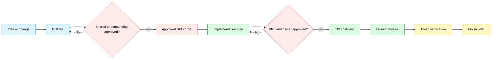

<div align="center">

# 🔥 GrillPowers

*Clarify first. Build with discipline. Finish with evidence.*

[](LICENSE)


<table>
<tr><td align="left">
Coding starts while key product decisions remain unresolved.<br>
Assumptions leak from conversation into implementation.<br>
Completion is declared before tests, review, and fresh verification.
</td></tr>
</table>

**GrillPowers connects one-decision-at-a-time product clarification to plan-driven engineering through an explicit specification gate.**

`Idea → clarify → approve specification → plan → TDD → review → verify → finish`

<a href="#install">Install</a> ·
<a href="#workflow">Workflow</a> ·
<a href="#usage">Usage</a> ·
<a href="#example">Example</a> ·
<a href="#structure">Structure</a>

[**English**](README.md) · [**简体中文**](docs/lang/README_ZH.md)

</div>

---

<a id="modes"></a>

## 🧩 Choose an installation mode

| Mode | Best for | What happens |
|---|---|---|
| **Managed isolated install** | A clean, reproducible setup | The installer fetches both upstreams at locked commits, installs the GrillPowers bridge, and exposes only the selected skills. |
| **Manual integration** | A machine that already manages Matt Pocock Skills or Superpowers | Keep the existing upstream directories, add `skills/grill-powers`, and mirror the selection in `config/skill-selection.json`. |

The managed installer performs a preflight check and stops when a target already exists. It prints its intended paths in dry-run mode and does not silently replace an installation.

<a id="systems"></a>

## ✨ Four stages, one workflow

| Stage | Owner | Responsibility | Exit condition |
|---|---|---|---|
| Product discovery | Grill Me | Inspect facts, question one decision at a time, and confirm shared understanding. | The user explicitly approves the recap. |
| Specification gate | `to-spec` | Turn confirmed intent into scope, flows, domain rules, and testable acceptance criteria. | The user approves `SPEC.md`. |
| Delivery planning | `superpowers:writing-plans` | Convert approved acceptance criteria into ordered implementation and test work, then recommend one delivery owner. | The user approves both the plan and the delivery owner. |
| Engineering delivery | One Superpowers executor | Implement with TDD, handle failures systematically, own reviews, and gather fresh evidence. | Verification supports the completion claim. |

GrillPowers is the bridge. It keeps the handoff stable and routes material product changes back through discovery and specification before delivery continues.

<a id="workflow"></a>

## 🗺 Workflow



The approval gate separates product truth from implementation choice. If delivery reveals a material behavior or scope decision, the loop returns to Grill Me, updates `SPEC.md`, and revises the plan.

<a id="managed"></a>

## 📦 What GrillPowers manages

### Installed components

- One original orchestration skill: `skills/grill-powers`
- Matt Pocock Skills pinned to `9603c1cc8118d08bc1b3bf34cf714f62178dea3b`
- Superpowers v6.1.1 pinned to `d884ae04edebef577e82ff7c4e143debd0bbec99`
- A curated discovery surface that keeps Matt on product discovery and Superpowers on engineering delivery

### Working artifacts

- An approved `SPEC.md` with testable acceptance criteria
- An implementation plan traced back to the specification
- Code and tests produced by one delivery owner
- Review findings and fresh verification evidence

GrillPowers keeps these artifacts in the user's project. This repository contains the workflow definition, installation metadata, and fictional examples only.

<a id="install"></a>

## ⚡ Install

### Requirements

- Windows PowerShell 5.1 or newer
- Git
- Codex skill discovery through a local skills directory

### Managed install

Run the dry check first:

```powershell
Set-ExecutionPolicy -Scope Process Bypass
.\scripts\install.ps1 -WhatIf
```

Review the printed paths, then install and verify:

```powershell
.\scripts\install.ps1
.\scripts\verify.ps1
```

Both scripts accept `-InstallRoot` and `-DiscoveryRoot` for isolated or test installations. The installer also accepts `-MattSourceRoot` and `-SuperpowersSourceRoot` when clean local checkouts already exist at the locked commits.

### Manual integration

If both upstream projects are already installed and versioned by another system:

1. Copy `skills/grill-powers` into the host's skill directory.
2. Keep the upstream namespaces and complete skill directories intact.
3. Expose the entries listed in `config/skill-selection.json`.
4. Confirm that `to-spec` hands off to `superpowers:writing-plans`.
5. Run the skill validator from the host environment.

### Repository regression

Maintainers can exercise dry-run, conflict refusal, isolated installation, routing, and tamper detection with two clean checkouts at the locked commits:

```powershell
.\scripts\test-install.ps1 `
  -MattSourceRoot C:\path\to\mattpocock-skills `
  -SuperpowersSourceRoot C:\path\to\superpowers
```

The suite creates a unique operating-system temp directory and limits cleanup to that test root.

<a id="usage"></a>

## 🚀 Usage

Start with a real product idea, request, or change:

```text
Use $grill-powers to take saved-search sharing from an unresolved idea through verified delivery.
```

Expect this interaction contract:

1. Grill Me inspects available facts and asks one decision question.
2. Each question includes a recommendation; the workflow waits for your answer.
3. You approve a shared-understanding recap.
4. You review and approve `SPEC.md`.
5. Superpowers writes the implementation plan and recommends one delivery owner.
6. You explicitly approve both the plan and that owner.
7. Delivery proceeds through TDD, owned reviews, fresh verification, and a finish choice.

You retain every product decision. GrillPowers preserves those decisions as the contract for engineering work.

<a id="principles"></a>

## 🛡 Operating principles

1. **Inspect before asking.** Use repository and document facts to avoid questions that already have answers.
2. **One decision at a time.** Keep each answer meaningful and reduce accidental agreement.
3. **Approval is explicit.** A recap and a specification each need a clear confirmation.
4. **One delivery owner.** Choose one Superpowers executor so TDD, checkpoints, and reviews have clear ownership.
5. **Scope changes loop back.** A material product change updates discovery, specification, and plan in that order.
6. **Evidence stays fresh.** Completion claims cite commands and observable results produced after the final change.

<a id="example"></a>

## 🎬 Example: Saved Search Links

The initial request is deliberately incomplete:

> Let users share a saved search. We need it quickly.

Grill Me resolves the choices that change the product:

- Who may create and open a link?
- Does access require an account?
- Can the owner revoke it?
- Does it expire?
- What should an invalid or unauthorized visitor see?

After the user approves the answers, `to-spec` captures the flow, scope, domain rules, and acceptance criteria. `superpowers:writing-plans` then chooses implementation steps and test cases. One executor owns delivery; verification records the final commands and observed behavior.

See the complete fictional artifact chain:

- [Initial request](examples/INPUT.md)
- [Approved specification](examples/SPEC.md)
- [Implementation plan](examples/IMPLEMENTATION-PLAN.md)
- [Verification record](examples/VERIFICATION.md)

<a id="structure"></a>

## 📂 Project structure

```text
grill-powers/
├── README.md
├── LICENSE
├── THIRD_PARTY_NOTICES.md
├── config/
│   ├── sources.lock.json
│   └── skill-selection.json
├── docs/
│   └── lang/
│       └── README_ZH.md
├── examples/
│   ├── INPUT.md
│   ├── SPEC.md
│   ├── IMPLEMENTATION-PLAN.md
│   └── VERIFICATION.md
├── LICENSES/
│   ├── mattpocock-skills-MIT.txt
│   └── superpowers-MIT.txt
├── scripts/
│   ├── install.ps1
│   ├── verify.ps1
│   └── test-install.ps1
└── skills/
    └── grill-powers/
        ├── SKILL.md
        ├── LICENSE
        ├── THIRD_PARTY_NOTICES.md
        ├── LICENSES/
        │   ├── mattpocock-skills-MIT.txt
        │   └── superpowers-MIT.txt
        ├── agents/
        │   └── openai.yaml
        └── references/
            └── handoff-contract.md
```

<a id="notes"></a>

## 📌 Notes

- v1 ships a tested Windows PowerShell installer. Manual integration remains available for other hosts.
- Source commits and the selected discovery surface are data files under `config/`, so upgrades are explicit and reviewable.
- The upstream projects remain in their own namespaces and retain their complete directory structure.
- The installer does not publish, push, delete an existing installation, or modify an unrelated repository.

<a id="credits"></a>

## Credits and license

GrillPowers is an independent workflow integration built around [Matt Pocock's Skills](https://github.com/mattpocock/skills) and [Jesse Vincent's Superpowers](https://github.com/obra/superpowers). It is not affiliated with or endorsed by either upstream project.

Original GrillPowers content is available under the [MIT License](LICENSE). Upstream notices and exact license copies are in [THIRD_PARTY_NOTICES.md](THIRD_PARTY_NOTICES.md) and [LICENSES](LICENSES).

<div align="center">

**Clarify the decision. Approve the specification. Finish with evidence.**

</div>
