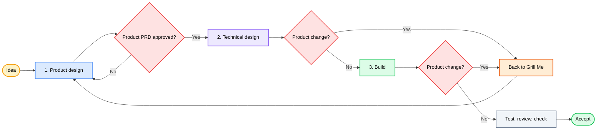

<div align="center">


### *"Clarify the product. Approve the PRD. Ship with proof."*

[](LICENSE)
[](https://agentskills.io)


[](https://github.com/okht/grill-powers)


<br>

<table>
<tr><td align="left">

🧑‍💼 &nbsp;Product talk and tech talk land in the same thread.<br>
🧩 &nbsp;People without an engineering background get pulled into design choices they cannot judge.<br>
📈 &nbsp;Each new tech option reopens scope. The list grows. It rarely shrinks.

</td></tr>
</table>

### ✨ GrillPowers keeps you in the product-manager seat from idea to accept.

<br>

Joins **[Grill Me](https://github.com/mattpocock/skills)** and **[Superpowers](https://github.com/obra/superpowers)**. Splits the work into three stages.

**Grill Me** — one product decision at a time · **Superpowers** — plan, TDD, review, fresh checks

**Idea → product design → technical design → build → check → accept**

<br>

[🎯 Why](#-why) · [✨ Stages](#-stages) · [🗺 Flow](#-flow) · [🔁 Scope change](#-scope-change) · [📦 What you get](#-what-you-get) · [⚡ Install](#-install) · [🚀 Usage](#-usage) · [✨ Demo](#-demo)

[**English**](README.md) · [**简体中文**](docs/lang/README_ZH.md)

</div>

---

<div align="center">

Built around [Matt Pocock's Skills](https://github.com/mattpocock/skills) · [Jesse Vincent's Superpowers](https://github.com/obra/superpowers) · by [@okht](https://github.com/okht)

</div>

---

## 🎯 Why

### 1️⃣ Two upstream strengths

<table>
<thead>
<tr>
<th width="50%" align="center">🔥 Grill Me</th>
<th width="50%" align="center">⚡ Superpowers</th>
</tr>
</thead>
<tbody>
<tr>
<td align="center"><sub>Product questions</sub></td>
<td align="center"><sub>Delivery</sub></td>
</tr>
<tr>
<td><sub>One decision at a time, a clear pick, wait for your yes.</sub></td>
<td><sub>Plans, tests, debug, review, fresh checks.</sub></td>
</tr>
</tbody>
</table>

### 2️⃣ The mix that breaks product work

Used alone on product work, Superpowers mixes “what should we build” with “how should we build it.” You answer architecture questions you did not mean to answer. Scope creeps.

GrillPowers keeps both strengths and draws hard lines between stages.

| Problem | What GrillPowers does |
|---|---|
| 🧑‍💼 Product and tech questions share one chat | Finish and approve product design before technical design starts |
| 🧩 The user is asked how to implement | The agent owns architecture, data, interfaces, tests, and task plan |
| 📈 Tech options keep growing the product | A real product change mid-build returns to Grill Me, then re-walks approve → PRD → plan |

---

## ✨ Stages

<table>
<thead>
<tr>
<th width="33%" align="center">1️⃣ Product design</th>
<th width="33%" align="center">2️⃣ Technical design</th>
<th width="33%" align="center">3️⃣ Build</th>
</tr>
</thead>
<tbody>
<tr>
<td align="center"><sub>You set audience, value, scope, rules, done criteria</sub></td>
<td align="center"><sub>You only decide trade-offs that change product behavior, cost, risk, or scope</sub></td>
<td align="center"><sub>You accept or reject what you can see</sub></td>
</tr>
<tr>
<td><sub>Agent checks facts, asks one product decision at a time, recommends, writes a product-only PRD.</sub></td>
<td><sub>Agent turns the approved product into architecture, data, interfaces, tests, and a build plan.</sub></td>
<td><sub>Agent codes, tests, debugs, reviews, runs fresh checks.</sub></td>
</tr>
<tr>
<td align="center"><sub><b>Done:</b> you approve the product-only PRD</sub></td>
<td align="center"><sub><b>Done:</b> design meets every acceptance line without moving the product boundary</sub></td>
<td align="center"><sub><b>Done:</b> checks pass; you accept the product</sub></td>
</tr>
</tbody>
</table>

You decide what exists, for whom, where the edge is, and what “done” means. The approved PRD contains product intent and observable behavior only. The agent owns every technical choice from that boundary through checked delivery.

### The PRD boundary

| Product-only PRD | Agent-owned technical plan |
|---|---|
| Users, problem, outcome, scope, flows | Architecture, stack, modules, files |
| Product rules and user-visible states | Data model, APIs, interfaces, algorithms |
| Observable acceptance criteria | Tests, work breakdown, commands, deployment |
| Open and deferred product decisions | Delivery owner and implementation sequence |

Known repository details do not enter the PRD automatically. If a technical limit changes product behavior, scope, cost, or risk, GrillPowers asks for the resulting product decision and leaves the mechanism to the agent.

---

## 🗺 Flow



You show up for product design, PRD approval, and final acceptance. The agent runs technical design and build without asking you to approve architecture, the plan, or the delivery owner. If a later find moves the product boundary, work pauses and returns through the product path below.

---

## 🔁 Scope change

Tech design or coding often surfaces a product fact the spec never settled: a permission edge, a cheaper path that changes the promise, two fair readings of one acceptance line, or a cut driven by cost.

Do not stretch the product while coding. Do not let the agent pick a product trade-off to “keep moving.” Do not jump from a mid-build insight into half-done code with new unspoken scope.

### 1️⃣ Pause → Grill Me → gates → resume

1. **Pause** the work that depends on the open product question. Other work can continue.
2. **Return to Grill Me.** One product decision at a time. Get a recommendation.
3. **Re-walk the gates in order:** shared understanding approved → update affected PRD sections and any consistency-dependent sections → publish and approve the complete revised PRD → plan updated with `superpowers:writing-plans`.
4. **Resume** only under the new approved product boundary.

```text
product change found in design or code
        │
        ▼
   pause affected work
        │
        ▼
   Grill Me
        │
        ▼
   recap approved → update affected PRD sections
        │
        ▼
       approve complete PRD revision
        │
        ▼
   revise plan → resume build
```

### 2️⃣ Material vs stay-in-delivery

| Signal | Action |
|---|---|
| 🔴 Changes user-visible behavior, core flow, scope, acceptance, business rules, permissions, privacy, billing, data meaning, or irreversible ops | Pause. Full re-entry from Grill Me |
| 🔴 PRD has two fair readings | Treat as an open product decision |
| 🔴 Build wants to drop or swap a promised requirement because it is hard | Product decides. Build does not rewrite the promise |
| 🟢 File layout, interfaces, data shapes, tests, mocks, bug fix with no behavior change | Stay in Superpowers |
| 🟡 Clear, low-risk user-visible micro-change | Stay in delivery only after you confirm. Record a small PRD revision |

A trip back to Grill Me is not enough on its own. Skip a gate and the plan, tests, and code still point at a dead contract. Walk `grilling → shared-understanding approval → product-only to-spec → exact PRD approval → writing-plans` so scope can open when it must, then close on one approved edge. Revise the affected content, publish the whole PRD as a new revision with a change summary, and approve that complete revision. A full rewrite is reserved for broad changes to the product premise, target users, or core flows.

---

## 📦 What you get

### Installed components

- One orchestration skill: `skills/grill-powers`
- Matt Pocock Skills pinned to `9603c1cc8118d08bc1b3bf34cf714f62178dea3b`
- Superpowers v6.1.1 pinned to `d884ae04edebef577e82ff7c4e143debd0bbec99`
- One entrypoint over a fixed set of upstream skills

### Working artifacts

| Artifact | Role |
|---|---|
| ✅ Approved product-only PRD | Product behavior and acceptance lines, with no technical design |
| 🧭 Tech design and build plan | Owned by the agent; traces to the PRD |
| 💻 Code and tests | One delivery owner |
| 🧪 Review, checks, accept | Fresh evidence; you sign off the product |

This repo holds the workflow, install metadata, and made-up examples. Your real artifacts live in your project.

---

## ⚡ Install

You have an Agent — let it install itself. Open Codex (or any host that can fetch skills) and hand it this line:

> Install the GrillPowers skill for me: `https://github.com/okht/grill-powers`

The Agent clones the repo, puts `skills/grill-powers` where the host loads skills, and runs the install script when it needs the pinned Grill Me and Superpowers trees. Once done, start with `$grill-powers`.

<details>
<summary><b>🛠️ Want to install it yourself? Click for scripts and paths</b></summary>

<br>

Needs Windows PowerShell 5.1+, Git, and a local skills directory for Codex.

| Mode | Use when | Does |
|---|---|---|
| Managed install | Clean machine | Fetches both upstreams at locked commits, installs the bridge, exposes the selected skills |
| Manual | You already manage Matt or Superpowers | Keep those trees, add `skills/grill-powers`, match `config/skill-selection.json` |

```powershell
Set-ExecutionPolicy -Scope Process Bypass
.\scripts\install.ps1 -WhatIf
.\scripts\install.ps1
.\scripts\verify.ps1
```

Scripts take `-InstallRoot` and `-DiscoveryRoot`. Use `-MattSourceRoot` and `-SuperpowersSourceRoot` if you already have clean checkouts on the locked commits. The installer checks first, stops if the target exists, and does not overwrite an install in silence.

**Manual steps** when both upstreams already live elsewhere:

1. Copy `skills/grill-powers` into the host skill directory.
2. Keep upstream names and full skill trees.
3. Expose the entries in `config/skill-selection.json`.
4. Confirm GrillPowers applies its product-only PRD contract before `to-spec` hands off to `superpowers:writing-plans`.
5. Run the host skill check.

**Maintainer test** (two clean locked checkouts):

```powershell
.\scripts\test-install.ps1 `
  -MattSourceRoot C:\path\to\mattpocock-skills `
  -SuperpowersSourceRoot C:\path\to\superpowers
```

</details>

---

## 🚀 Usage

Start with a real product idea:

```text
Use $grill-powers to take saved-search sharing from an open idea through checked delivery.
```

### 🎛️ Interaction contract

1. State the goal in product words.
2. GrillPowers checks known facts and asks one product decision at a time, with a recommendation.
3. You approve a product-only PRD and its acceptance lines.
4. GrillPowers independently writes the technical design and build plan, then selects one delivery owner.
5. It brings back only choices that change product behavior, scope, cost, or risk.
6. It codes, tests, debugs, reviews, and checks.
7. You review what you can see and accept or reject.

Your product decisions stay the contract for all technical work.

### 🛡 Rules the agent follows

1. **Product design first.** Tech options do not set the product edge by accident.
2. **One product decision at a time.**
3. **The PRD stays product-only.** It contains no architecture, data model, API, test strategy, task plan, or delivery choice.
4. **You stay product manager.** The agent owns architecture, data, interfaces, tests, task plan, and delivery owner.
5. **Technical design traces** to the approved product rules and acceptance lines.
6. **Product-impacting change:** pause, Grill Me, re-approve the PRD, revise the plan, then resume.
7. **Build ends** with fresh checks and your acceptance.

---

## ✨ Demo

Starter request (left incomplete on purpose):

> Let users share a saved search. We need it quickly.

Product design settles the choices that change the product:

- Who may create and open a link?
- Does access need an account?
- Can the owner revoke it?
- Does it expire?
- What does an invalid or blocked visitor see?

After you approve the product-only PRD, the product edge freezes. The agent picks the data model, interfaces, permission checks, test plan, build plan, and delivery owner without a technical approval gate. It asks you only when a technical limit would change the product, cost, risk, or scope. Then it builds and checks. You review the result.

| Step | Artifact |
|------|----------|
| 1️⃣ | [Initial request](examples/INPUT.md) |
| 2️⃣ | [Approved product-only PRD](examples/SPEC.md) |
| 3️⃣ | [Build plan](examples/IMPLEMENTATION-PLAN.md) |
| 4️⃣ | [Check record](examples/VERIFICATION.md) |

> ⚠️ **About this demo** — these files are fiction. They show the shape of each stage. They are not a real feature design.

---

## 📂 Project Structure

```text
grill-powers/
├── README.md
├── LICENSE
├── THIRD_PARTY_NOTICES.md
├── config/
│   ├── sources.lock.json          # pinned upstream commits
│   └── skill-selection.json       # discovery surface
├── docs/lang/README_ZH.md
├── examples/
│   ├── INPUT.md
│   ├── SPEC.md
│   ├── IMPLEMENTATION-PLAN.md
│   └── VERIFICATION.md
├── LICENSES/
├── scripts/
│   ├── install.ps1
│   ├── verify.ps1
│   └── test-install.ps1
└── skills/grill-powers/
    ├── SKILL.md
    ├── agents/openai.yaml
    └── references/handoff-contract.md
```

---

## ⚠️ Notes

- v1 ships a Windows PowerShell installer. Manual install works for other hosts.
- Locked commits and the skill list live under `config/`. Upgrades are explicit.
- Upstream projects keep their own namespaces and full trees.
- The installer does not publish, push, delete an existing install, or touch an unrelated repo.

---

## 📄 Credits and license

GrillPowers is an independent glue of [Matt Pocock's Skills](https://github.com/mattpocock/skills) and [Jesse Vincent's Superpowers](https://github.com/obra/superpowers). Neither project endorses this repo.

Original GrillPowers text is [MIT](LICENSE). Upstream notices: [THIRD_PARTY_NOTICES.md](THIRD_PARTY_NOTICES.md) and [LICENSES](LICENSES).

---

<div align="center">

**MIT License** © [okht](https://github.com/okht)

</div>
