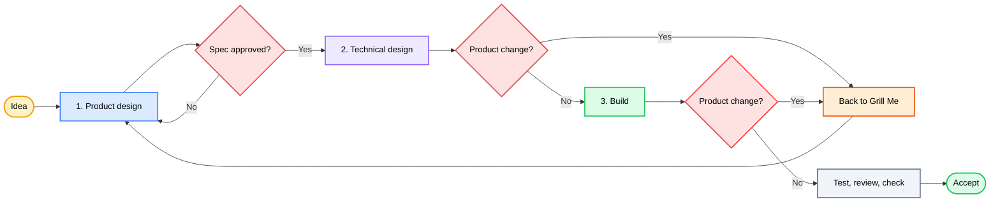

<div align="center">

# 🔥 GrillPowers

### Clarify the product. Build the plan. Ship with proof.

[](LICENSE)


[](https://github.com/okht)

<br>

<table>
<tr><td align="left">

🔀 &nbsp;Product talk and tech talk land in the same thread.<br>
🧩 &nbsp;People without an engineering background get pulled into design choices they cannot judge.<br>
📈 &nbsp;Each new tech option reopens scope. The list grows. It rarely shrinks.

</td></tr>
</table>

<br>

GrillPowers joins **[Grill Me](https://github.com/mattpocock/skills)** and **[Superpowers](https://github.com/obra/superpowers)**. It splits the work into three stages so you stay the product manager from idea to accept.

```text
Idea → product design → technical design → build → check → accept
```

<br>

[🎯 Why](#-why) · [✨ Stages](#-stages) · [🗺 Flow](#-flow) · [🔁 When scope changes](#-when-scope-changes) · [⚡ Install](#-install) · [🚀 Use](#-use) · [🎬 Example](#-example)

[**English**](README.md) · [**简体中文**](docs/lang/README_ZH.md)

</div>

---

## 🎯 Why

Grill Me is good at product questions: one decision at a time, a clear pick, wait for your yes. Superpowers is good at delivery: plans, tests, debug, review, fresh checks.

Used alone on product work, Superpowers mixes “what should we build” with “how should we build it.” You answer architecture questions you did not mean to answer. Scope creeps.

GrillPowers keeps both strengths and draws hard lines between stages.

| Problem | What GrillPowers does |
|---|---|
| 🔀 Product and tech questions share one chat | Finish and approve product design before technical design starts |
| 🧩 The user is asked how to implement | The agent owns architecture, data, interfaces, tests, and task plan |
| 📈 Tech options keep growing the product | A real product change mid-build returns to Grill Me, then re-walks approve → spec → plan |

---

## ✨ Stages

| | 1️⃣ Product design | 2️⃣ Technical design | 3️⃣ Build |
|---|---|---|---|
| **You** | Who it is for, value, scope, rules, done criteria | Only trade-offs that change product behavior, cost, risk, or scope | Accept or reject what you can see |
| **Agent** | Check facts, ask one product decision at a time, recommend, write the product spec | Turn the approved product into architecture, data, interfaces, tests, and a build plan | Code, test, debug, review, run fresh checks |
| **Done when** | You approve the product spec | The design meets every acceptance line and does not move the product boundary | Checks pass and you accept the product |

You decide what exists, for whom, where the edge is, and what “done” means. The agent owns the path from approved product design to checked build.

---

## 🗺 Flow



You show up for product design and final accept. The agent runs technical design and build. If a later find moves the product boundary, work pauses and returns through the product path below.

---

## 🔁 When scope changes

Tech design or coding often surfaces a product fact the spec never settled: a permission edge, a cheaper path that changes the promise, two fair readings of one acceptance line, or a cut driven by cost.

Do not stretch the product while coding. Do not let the agent pick a product trade-off to “keep moving.” Do not jump from a mid-build insight into half-done code with new unspoken scope.

Instead:

1. ⏸ **Pause** the work that depends on the open product question. Other work can continue.
2. 🔥 **Return to Grill Me.** One product decision at a time. Get a recommendation.
3. 🚪 **Re-walk the gates in order:** shared understanding approved → `to-spec` approved → plan updated with `superpowers:writing-plans`.
4. ▶ **Resume** only under the new approved product boundary.

```text
product change found in design or code
        │
        ▼
   pause affected work
        │
        ▼
   Grill Me
        │
        ▼
   recap approved → to-spec approved
        │
        ▼
   revise plan → resume build
```

| Signal | Action |
|---|---|
| 🔴 Changes user-visible behavior, core flow, scope, acceptance, business rules, permissions, privacy, billing, data meaning, or irreversible ops | Pause. Full re-entry from Grill Me |
| 🔴 Spec has two fair readings | Treat as an open product decision |
| 🔴 Build wants to drop or swap a promised requirement because it is hard | Product decides. Build does not rewrite the promise |
| 🟢 File layout, interfaces, data shapes, tests, mocks, bug fix with no behavior change | Stay in Superpowers |
| 🟡 Clear, low-risk user-visible micro-change | Stay in delivery only after you confirm. Record a small spec revision |

A trip back to Grill Me is not enough on its own. Skip a gate and the plan, tests, and code still point at a dead contract. Walk `grilling → approve → to-spec → writing-plans` so scope can open when it must, then close on one approved edge.

---

## 📦 What you get

### Installed

- 🧩 Orchestration skill: `skills/grill-powers`
- 📌 Matt Pocock Skills pinned to `9603c1cc8118d08bc1b3bf34cf714f62178dea3b`
- 📌 Superpowers v6.1.1 pinned to `d884ae04edebef577e82ff7c4e143debd0bbec99`
- 🚪 One entrypoint over a fixed set of upstream skills

### In your project

| File / result | Role |
|---|---|
| ✅ Approved product spec | Acceptance lines you can test |
| 🧭 Tech design and build plan | Owned by the agent; traces to the product spec |
| 💻 Code and tests | One delivery owner |
| 🧪 Review, checks, accept | Fresh evidence; you sign off the product |

This repo holds the workflow, install metadata, and made-up examples. Your real artifacts live in your project.

---

## ⚡ Install

Paste this into your agent (Codex or any host that can fetch skills):

> Install GrillPowers for me: `https://github.com/okht/grill-powers`

The agent clones the repo, puts `skills/grill-powers` where the host loads skills, and runs the install script when it needs the pinned Grill Me and Superpowers trees. Then start with `$grill-powers`.

<details>
<summary><b>🛠️ Scripts and manual install</b></summary>

<br>

Needs Windows PowerShell 5.1+, Git, and a local skills directory for Codex.

| Mode | Use when | Does |
|---|---|---|
| Managed install | Clean machine | Fetches both upstreams at locked commits, installs the bridge, exposes the selected skills |
| Manual | You already manage Matt or Superpowers | Keep those trees, add `skills/grill-powers`, match `config/skill-selection.json` |

```powershell
Set-ExecutionPolicy -Scope Process Bypass
.\scripts\install.ps1 -WhatIf
.\scripts\install.ps1
.\scripts\verify.ps1
```

Scripts take `-InstallRoot` and `-DiscoveryRoot`. Use `-MattSourceRoot` and `-SuperpowersSourceRoot` if you already have clean checkouts on the locked commits. The installer checks first, stops if the target exists, and does not overwrite an install in silence.

**Manual steps** when both upstreams already live elsewhere:

1. Copy `skills/grill-powers` into the host skill directory.
2. Keep upstream names and full skill trees.
3. Expose the entries in `config/skill-selection.json`.
4. Confirm `to-spec` hands off to `superpowers:writing-plans`.
5. Run the host skill check.

**Maintainer test** (two clean locked checkouts):

```powershell
.\scripts\test-install.ps1 `
  -MattSourceRoot C:\path\to\mattpocock-skills `
  -SuperpowersSourceRoot C:\path\to\superpowers
```

</details>

---

## 🚀 Use

Give it a real product idea:

```text
Use $grill-powers to take saved-search sharing from an open idea through checked delivery.
```

1. State the goal in product words.
2. GrillPowers checks known facts and asks one product decision at a time, with a recommendation.
3. You approve the product design and its acceptance lines.
4. GrillPowers writes the technical design and build plan. It brings back only choices that change product behavior, scope, cost, or risk.
5. It codes, tests, debugs, reviews, and checks.
6. You review what you can see and accept or reject.

Your product decisions stay the contract for all technical work.

### 🛡 Rules the agent follows

1. **Product design first.** Tech options do not set the product edge by accident.
2. **One product decision at a time.**
3. **You stay product manager.** The agent owns architecture, data, interfaces, tests, and task plan.
4. **Technical design traces** to the approved product rules and acceptance lines.
5. **Product-impacting change:** pause, Grill Me, re-approve spec, revise plan, then resume. Never swallow scope inside code.
6. **Build ends** with fresh checks and your accept.

---

## 🎬 Example

Starter request (left incomplete on purpose):

> Let users share a saved search. We need it quickly.

Product design settles the choices that change the product:

- Who may create and open a link?
- Does access need an account?
- Can the owner revoke it?
- Does it expire?
- What does an invalid or blocked visitor see?

After you approve, the product edge freezes. The agent picks data model, interfaces, permission checks, test plan, and build plan. It asks you only when a tech limit would change the product, cost, risk, or scope. Then it builds and checks. You review the result.

| Step | File |
|------|------|
| 1️⃣ | [Initial request](examples/INPUT.md) |
| 2️⃣ | [Approved spec](examples/SPEC.md) |
| 3️⃣ | [Build plan](examples/IMPLEMENTATION-PLAN.md) |
| 4️⃣ | [Check record](examples/VERIFICATION.md) |

These files are fiction. They show the shape of each stage. They are not a real feature design.

---

## 📂 Layout

```text
grill-powers/
├── README.md
├── LICENSE
├── THIRD_PARTY_NOTICES.md
├── config/
│   ├── sources.lock.json          # pinned upstream commits
│   └── skill-selection.json       # discovery surface
├── docs/lang/README_ZH.md
├── examples/
│   ├── INPUT.md
│   ├── SPEC.md
│   ├── IMPLEMENTATION-PLAN.md
│   └── VERIFICATION.md
├── LICENSES/
├── scripts/
│   ├── install.ps1
│   ├── verify.ps1
│   └── test-install.ps1
└── skills/grill-powers/
    ├── SKILL.md
    ├── agents/openai.yaml
    └── references/handoff-contract.md
```

---

## 📌 Notes

- v1 ships a Windows PowerShell installer. Manual install works for other hosts.
- Locked commits and the skill list live under `config/`. Upgrades are explicit.
- Upstream projects keep their own namespaces and full trees.
- The installer does not publish, push, delete an existing install, or touch an unrelated repo.

---

## 📄 Credits and license

GrillPowers is an independent glue of [Matt Pocock's Skills](https://github.com/mattpocock/skills) and [Jesse Vincent's Superpowers](https://github.com/obra/superpowers). Neither project endorses this repo.

Original GrillPowers text is [MIT](LICENSE). Upstream notices: [THIRD_PARTY_NOTICES.md](THIRD_PARTY_NOTICES.md) and [LICENSES](LICENSES).

---

<div align="center">

**MIT License** © [okht](https://github.com/okht)

</div>
