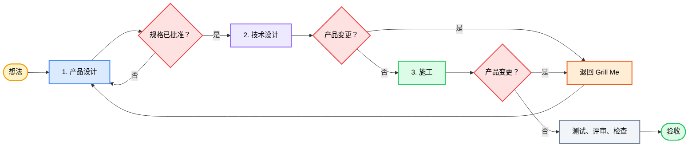

<div align="center">

# 🔥 GrillPowers

### *「先澄清产品，再写计划，用证据交付。」*

[](../../LICENSE)
[](https://agentskills.io)


[](https://github.com/okht/grill-powers)


<br>

<table>
<tr><td align="left">

🧑‍💼 &nbsp;产品问题和技术问题挤在同一轮对话里。<br>
🧩 &nbsp;没有工程背景的人被拉去选实现方案，却没法判断。<br>
📈 &nbsp;每个新技术选项都会重新打开范围。清单变长，很少变短。

</td></tr>
</table>

### ✨ GrillPowers 让你从想法到验收都只当产品经理。

<br>

接上 **[Grill Me](https://github.com/mattpocock/skills)** 和 **[Superpowers](https://github.com/obra/superpowers)**。工作拆成三个阶段。

**Grill Me** — 一次一个产品决策 · **Superpowers** — 计划、TDD、评审、新检查

**想法 → 产品设计 → 技术设计 → 施工 → 检查 → 验收**

<br>

[🎯 为什么](#-为什么) · [✨ 阶段](#-阶段) · [🗺 流程](#-流程) · [🔁 范围变了](#-范围变了) · [📦 你会得到什么](#-你会得到什么) · [⚡ 安装](#-安装) · [🚀 使用](#-使用) · [✨ 示例](#-示例)

[**English**](../../README.md) · [**简体中文**](README_ZH.md)

</div>

---

<div align="center">

基于 [Matt Pocock Skills](https://github.com/mattpocock/skills) · [Jesse Vincent Superpowers](https://github.com/obra/superpowers) · [@okht](https://github.com/okht)

</div>

---

## 🎯 为什么

### 1️⃣ 两个上游的强项

<table>
<thead>
<tr>
<th width="50%" align="center">🔥 Grill Me</th>
<th width="50%" align="center">⚡ Superpowers</th>
</tr>
</thead>
<tbody>
<tr>
<td align="center"><sub>产品问题</sub></td>
<td align="center"><sub>交付</sub></td>
</tr>
<tr>
<td><sub>一次一个决策，给明确选项，等你点头。</sub></td>
<td><sub>计划、测试、调试、评审、新跑出来的检查。</sub></td>
</tr>
</tbody>
</table>

### 2️⃣ 混聊会搞砸产品工作

单独拿 Superpowers 做产品工作时，它常把「做什么」和「怎么做」混在一起聊。你会答一堆本意不是产品决策的架构题。范围跟着涨。

GrillPowers 两边都留，并在阶段之间画硬线。

| 问题 | GrillPowers 怎么做 |
|---|---|
| 🧑‍💼 产品和技术问题同一聊天 | 产品设计批完，才进技术设计 |
| 🧩 用户被问怎么实现 | 架构、数据、接口、测试、任务规划归 agent |
| 📈 技术选项不断把产品做大 | 施工中的实质产品变更退回 Grill Me，再按批准 → 规格 → 计划走回当前环节 |

---

## ✨ 阶段

<table>
<thead>
<tr>
<th width="33%" align="center">1️⃣ 产品设计</th>
<th width="33%" align="center">2️⃣ 技术设计</th>
<th width="33%" align="center">3️⃣ 施工</th>
</tr>
</thead>
<tbody>
<tr>
<td align="center"><sub>你定给谁、价值、范围、规则、怎样算完成</sub></td>
<td align="center"><sub>你只处理会改产品行为、成本、风险或范围的取舍</sub></td>
<td align="center"><sub>你接受或拒绝你看得到的结果</sub></td>
</tr>
<tr>
<td><sub>Agent 查事实，一次问一个产品决策，给推荐，写产品规格。</sub></td>
<td><sub>Agent 把已批准产品变成架构、数据、接口、测试和施工计划。</sub></td>
<td><sub>Agent 编码、测试、调试、评审、跑新的检查。</sub></td>
</tr>
<tr>
<td align="center"><sub><b>结束：</b>你批准产品规格</sub></td>
<td align="center"><sub><b>结束：</b>设计盖住每条验收，且不挪产品边界</sub></td>
<td align="center"><sub><b>结束：</b>检查通过；你验收产品</sub></td>
</tr>
</tbody>
</table>

你决定做什么、给谁做、边界在哪、怎样算完。Agent 负责从已批准的产品设计走到可检查的交付。

---

## 🗺 流程



你参与产品设计和最终验收。技术设计和施工归 agent。后面若发现会挪产品边界的事，就停住，按下一节走产品路径。

---

## 🔁 范围变了

技术设计或编码常会冒出规格没写死的产品事实：权限边界、会改承诺的「更便宜做法」、同一验收的两种读法，或因成本想砍掉一块。

不要边写代码边偷偷做大产品。不要让 agent 为了「先往前」替你做产品取舍。不要施工中半截发现新需求，跳过门禁带着未声明范围继续干。

### 1️⃣ 暂停 → Grill Me → 门禁 → 恢复

1. **暂停**依赖这个问题的技术工作。无关工作可继续。
2. **退回 Grill Me。** 一次一个产品决策。给推荐。
3. **按顺序重走门禁：** 共识批准 → `to-spec` 批准 → 用 `superpowers:writing-plans` 改计划。
4. **只在新的已批准产品边界下恢复。**

```text
设计或代码里发现产品变更
        │
        ▼
   暂停受影响工作
        │
        ▼
   Grill Me
        │
        ▼
   共识批准 → to-spec 批准
        │
        ▼
   改计划 → 恢复施工
```

### 2️⃣ 实质变更 vs 留在交付

| 信号 | 动作 |
|---|---|
| 🔴 改用户可见行为、核心流程、范围、验收、业务规则、权限、隐私、计费、数据含义或不可逆操作 | 暂停。从 Grill Me 完整回走 |
| 🔴 规格有两种合理读法 | 当成未决产品决策 |
| 🔴 因为难就想降低或换掉已承诺需求 | 产品决定。施工不重写承诺 |
| 🟢 文件布局、接口、数据结构、测试、mock、不改行为的缺陷修复 | 留在 Superpowers |
| 🟡 明确、低风险的用户可见小改 | 你确认后才可留在交付，并记规格小修订 |

只退回 Grill Me 不够。跳过门禁，计划、测试和代码仍会钉在一份作废的契约上。完整走 `grilling → 批准 → to-spec → writing-plans`，范围才能在需要时展开，再收回到一条已批准边界。

---

## 📦 你会得到什么

### 安装内容

- 一个编排技能：`skills/grill-powers`
- Matt Pocock Skills 钉在 `9603c1cc8118d08bc1b3bf34cf714f62178dea3b`
- Superpowers v6.1.1 钉在 `d884ae04edebef577e82ff7c4e143debd0bbec99`
- 一个入口，底下是固定好的上游技能集

### 工作产物

| 产物 | 作用 |
|---|---|
| ✅ 已批准产品规格 | 可测的验收行 |
| 🧭 技术设计与施工计划 | agent 负责，能追回产品规格 |
| 💻 代码与测试 | 一个交付负责人 |
| 🧪 评审、检查、验收 | 新跑出的证据；你签字产品结果 |

本仓库只有工作流、安装元数据和虚构示例。真产物在你的项目里。

---

## ⚡ 安装

你已经有 Agent 了——让它自己装。打开 Codex（或任何能拉 skill 的宿主），丢给它这一句：

> 帮我安装 GrillPowers skill：`https://github.com/okht/grill-powers`

Agent 克隆仓库，把 `skills/grill-powers` 放到宿主能发现的 skills 目录，需要时再跑安装脚本，拉齐锁定版本的 Grill Me 和 Superpowers。装完用 `$grill-powers` 启动。

<details>
<summary><b>🛠️ 想自己装？点开看脚本和路径</b></summary>

<br>

需要 Windows PowerShell 5.1+、Git，以及 Codex 用的本地 skills 目录。

| 方式 | 何时用 | 做什么 |
|---|---|---|
| 托管安装 | 干净机器 | 按锁定提交拉两个上游，装桥接，只公开选定技能 |
| 手动 | 本机已管 Matt 或 Superpowers | 保留原树，加 `skills/grill-powers`，对齐 `config/skill-selection.json` |

```powershell
Set-ExecutionPolicy -Scope Process Bypass
.\scripts\install.ps1 -WhatIf
.\scripts\install.ps1
.\scripts\verify.ps1
```

脚本支持 `-InstallRoot`、`-DiscoveryRoot`。本地已有锁定提交的干净 checkout 时，用 `-MattSourceRoot`、`-SuperpowersSourceRoot`。安装器先检查；目标已存在就停；不会静默覆盖。

**手动步骤**（两个上游已在别处管版本时）：

1. 把 `skills/grill-powers` 拷进宿主技能目录。
2. 保留上游命名空间和完整技能树。
3. 公开 `config/skill-selection.json` 里的入口。
4. 确认 `to-spec` 交给 `superpowers:writing-plans`。
5. 跑宿主技能检查。

**维护者测试**（两个锁定提交的干净 checkout）：

```powershell
.\scripts\test-install.ps1 `
  -MattSourceRoot C:\path\to\mattpocock-skills `
  -SuperpowersSourceRoot C:\path\to\superpowers
```

</details>

---

## 🚀 使用

从真实产品想法开始：

```text
使用 $grill-powers，把「分享已保存搜索」从开放想法推进到有检查的交付。
```

### 🎛️ 交互约定

1. 用产品语言说目标。
2. GrillPowers 查已知事实，一次问一个产品决策，并给推荐。
3. 你批准产品设计及其验收行。
4. GrillPowers 写技术设计和施工计划。只会把会改产品行为、范围、成本或风险的选择带回给你。
5. 它编码、测试、调试、评审并检查。
6. 你看可观察结果，接受或拒绝。

你的产品决策是后续全部技术工作的契约。

### 🛡 Agent 遵守的规则

1. **产品设计在先。** 技术选项不能误定产品边界。
2. **一次只处理一个产品决策。**
3. **你当产品经理。** 架构、数据、接口、测试、任务规划归 agent。
4. **技术设计追到**已批准的产品规则和验收行。
5. **影响产品的变化：** 暂停 → Grill Me → 重批规格 → 改计划 → 再继续。不在代码里吞范围。
6. **施工以**新检查和你的验收结束。

---

## ✨ 示例

起始请求（故意不完整）：

> 让用户分享一个已保存搜索。我们需要尽快完成。

产品设计要定下会改变产品的选择：

- 谁可以创建和打开链接？
- 访问要不要账号？
- 所有者能否撤销？
- 会不会过期？
- 无效或无权访问者看到什么？

你批准后，产品边界冻结。Agent 选数据模型、接口、权限检查、测试和施工计划。只有技术限制会改产品、成本、风险或范围时才再问你。然后施工并检查。你验收结果。

| 步骤 | 产物 |
|------|------|
| 1️⃣ | [初始请求](../../examples/INPUT.md) |
| 2️⃣ | [已批准规格](../../examples/SPEC.md) |
| 3️⃣ | [施工计划](../../examples/IMPLEMENTATION-PLAN.md) |
| 4️⃣ | [检查记录](../../examples/VERIFICATION.md) |

> ⚠️ **关于本示例** — 这些文件是虚构的。只展示各阶段长什么样。不是真功能设计。

---

## 📂 Project Structure

```text
grill-powers/
├── README.md
├── LICENSE
├── THIRD_PARTY_NOTICES.md
├── config/
│   ├── sources.lock.json          # 锁定的上游提交
│   └── skill-selection.json       # 发现范围
├── docs/lang/README_ZH.md
├── examples/
│   ├── INPUT.md
│   ├── SPEC.md
│   ├── IMPLEMENTATION-PLAN.md
│   └── VERIFICATION.md
├── LICENSES/
├── scripts/
│   ├── install.ps1
│   ├── verify.ps1
│   └── test-install.ps1
└── skills/grill-powers/
    ├── SKILL.md
    ├── agents/openai.yaml
    └── references/handoff-contract.md
```

---

## ⚠️ Notes

- v1 带 Windows PowerShell 安装器。其他宿主可手动装。
- 锁定提交和技能列表在 `config/`。升级要显式改。
- 上游保留自己的命名空间和完整目录。
- 安装器不发布、不推送、不删已有安装、不碰无关仓库。

---

## 📄 Credits and license

GrillPowers 是 [Matt Pocock Skills](https://github.com/mattpocock/skills) 与 [Jesse Vincent Superpowers](https://github.com/obra/superpowers) 的独立拼接。两个上游项目与本仓库无隶属、无背书。

GrillPowers 原创内容为 [MIT](../../LICENSE)。上游声明见 [THIRD_PARTY_NOTICES.md](../../THIRD_PARTY_NOTICES.md) 与 [LICENSES](../../LICENSES)。

---

<div align="center">

**MIT License** © [okht](https://github.com/okht)

</div>
