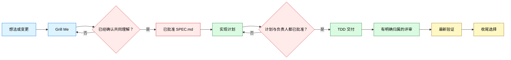

<div align="center">

# 🔥 GrillPowers

*先澄清，再严谨构建，最后用证据完成交付。*

[](../../LICENSE)


<table>
<tr><td align="left">
关键产品决策尚未解决，编码已经开始。<br>
未经确认的假设从对话流入实现。<br>
测试、评审和最新验证尚未完成，交付已经被宣布完成。
</td></tr>
</table>

**GrillPowers 通过一个明确的规格确认关口，把逐项澄清产品决策与计划驱动的工程交付连接起来。**

`想法 → 澄清 → 确认规格 → 计划 → TDD → 评审 → 验证 → 收尾`

<a href="#install">安装</a> ·
<a href="#workflow">工作流</a> ·
<a href="#usage">使用</a> ·
<a href="#example">示例</a> ·
<a href="#structure">结构</a>

[**English**](../../README.md) · [**简体中文**](README_ZH.md)

</div>

---

<a id="modes"></a>

## 🧩 选择安装方式

| 方式 | 适合场景 | 执行内容 |
|---|---|---|
| **托管式隔离安装** | 需要干净、可复现的配置 | 安装器按锁定提交获取两个上游，安装 GrillPowers 桥接技能，只公开精选技能。 |
| **手动集成** | 当前机器已经管理 Matt Pocock Skills 或 Superpowers | 保留现有上游目录，添加 `skills/grill-powers`，并按照 `config/skill-selection.json` 配置发现范围。 |

托管安装器会先执行预检；目标已存在时会停止。dry-run 会打印计划路径，安装器不会静默替换现有安装。

<a id="systems"></a>

## ✨ 四个阶段，一条工作流

| 阶段 | 负责人 | 职责 | 退出条件 |
|---|---|---|---|
| 产品发现 | Grill Me | 检查已有事实，逐项追问决策，确认共同理解。 | 用户明确确认总结。 |
| 规格关口 | `to-spec` | 把已确认意图整理为范围、流程、领域规则和可测试的验收标准。 | 用户批准 `SPEC.md`。 |
| 交付计划 | `superpowers:writing-plans` | 把已批准的验收标准转为有顺序的实现与测试工作，再推荐一个交付负责人。 | 用户同时批准计划与交付负责人。 |
| 工程交付 | 一个 Superpowers 执行器 | 用 TDD 实现，系统处理故障，负责评审，收集最新证据。 | 验证结果足以支撑完成结论。 |

GrillPowers 负责桥接。它保持交接稳定；产品行为或范围发生实质变化时，工作流会先返回发现与规格阶段，再继续交付。

<a id="workflow"></a>

## 🗺 工作流



确认关口把产品事实与实现选择分开。交付阶段发现实质行为或范围决策时，流程返回 Grill Me，更新 `SPEC.md`，再修订计划。

<a id="managed"></a>

## 📦 GrillPowers 管理的内容

### 安装组件

- 一个原创编排技能：`skills/grill-powers`
- Matt Pocock Skills 固定在 `9603c1cc8118d08bc1b3bf34cf714f62178dea3b`
- Superpowers v6.1.1 固定在 `d884ae04edebef577e82ff7c4e143debd0bbec99`
- 一组精选发现入口：Matt 负责产品发现，Superpowers 负责工程交付

### 工作产物

- 一份包含可测试验收标准的已批准 `SPEC.md`
- 一份可追溯到规格的实现计划
- 由一个交付负责人产出的代码和测试
- 评审结果与最新验证证据

这些产物保存在用户项目中。本仓库只包含工作流定义、安装元数据和虚构示例。

<a id="install"></a>

## ⚡ 安装

### 要求

- Windows PowerShell 5.1 或更高版本
- Git
- Codex 通过本地 skills 目录发现技能

### 托管安装

先运行 dry-run：

```powershell
Set-ExecutionPolicy -Scope Process Bypass
.\scripts\install.ps1 -WhatIf
```

检查打印出的路径，然后安装并验证：

```powershell
.\scripts\install.ps1
.\scripts\verify.ps1
```

两个脚本都接受 `-InstallRoot` 与 `-DiscoveryRoot`，可用于隔离安装或测试。如果本地已有位于锁定提交、工作树干净的 checkout，安装器还接受 `-MattSourceRoot` 与 `-SuperpowersSourceRoot`。

### 手动集成

如果两个上游项目已经由其他系统安装并管理版本：

1. 把 `skills/grill-powers` 复制到宿主的技能目录。
2. 保持上游命名空间与完整技能目录。
3. 公开 `config/skill-selection.json` 中列出的入口。
4. 确认 `to-spec` 会交接给 `superpowers:writing-plans`。
5. 在宿主环境中运行技能验证器。

### 仓库回归测试

维护者可以准备两个位于锁定提交、工作树干净的 checkout，验证 dry-run、冲突拒绝、隔离安装、路由与篡改检测：

```powershell
.\scripts\test-install.ps1 `
  -MattSourceRoot C:\path\to\mattpocock-skills `
  -SuperpowersSourceRoot C:\path\to\superpowers
```

测试套件会在操作系统临时目录下创建唯一测试根目录，清理范围只包含该测试根目录。

<a id="usage"></a>

## 🚀 使用

从真实的产品想法、需求或变更开始：

```text
使用 $grill-powers，把「分享已保存搜索」从未解决的想法推进到经过验证的交付。
```

你会得到以下交互契约：

1. Grill Me 检查已有事实，然后提出一个决策问题。
2. 每个问题都附带推荐答案；工作流会等待你的选择。
3. 你确认一份共同理解总结。
4. 你审阅并批准 `SPEC.md`。
5. Superpowers 编写实现计划，并推荐一个交付负责人。
6. 你明确批准计划与该负责人。
7. 交付依次经过 TDD、归属明确的评审、最新验证和收尾选择。

所有产品决策都由你保留。GrillPowers 把这些决策保存为工程工作的契约。

<a id="principles"></a>

## 🛡 运行原则

1. **提问前先检查。** 使用仓库和文档事实，减少已有答案的问题。
2. **一次处理一个决策。** 让每个回答保持清晰，降低无意确认的概率。
3. **确认必须明确。** 总结和规格都需要清晰确认。
4. **一个交付负责人。** 只选择一个 Superpowers 执行器，让 TDD、检查点和评审都有清楚归属。
5. **范围变化需要回环。** 实质产品变化依次更新发现、规格和计划。
6. **证据保持最新。** 完成结论引用最终变更之后运行的命令与可观察结果。

<a id="example"></a>

## 🎬 示例：分享已保存搜索

初始需求刻意保留了信息缺口：

> 让用户分享一个已保存搜索，我们需要尽快完成。

Grill Me 会解决真正改变产品的选择：

- 谁可以创建和打开链接？
- 访问是否要求登录？
- 所有者能否撤销链接？
- 链接是否过期？
- 无效链接或无权限访问者会看到什么？

用户确认答案后，`to-spec` 记录流程、范围、领域规则和验收标准。随后，`superpowers:writing-plans` 选择实现步骤与测试用例。一个执行器负责交付；验证记录最终命令和观察到的行为。

查看完整的虚构产物链：

- [初始需求](../../examples/INPUT.md)
- [已批准规格](../../examples/SPEC.md)
- [实现计划](../../examples/IMPLEMENTATION-PLAN.md)
- [验证记录](../../examples/VERIFICATION.md)

<a id="structure"></a>

## 📂 项目结构

```text
grill-powers/
├── README.md
├── LICENSE
├── THIRD_PARTY_NOTICES.md
├── config/
│   ├── sources.lock.json
│   └── skill-selection.json
├── docs/
│   └── lang/
│       └── README_ZH.md
├── examples/
│   ├── INPUT.md
│   ├── SPEC.md
│   ├── IMPLEMENTATION-PLAN.md
│   └── VERIFICATION.md
├── LICENSES/
│   ├── mattpocock-skills-MIT.txt
│   └── superpowers-MIT.txt
├── scripts/
│   ├── install.ps1
│   ├── verify.ps1
│   └── test-install.ps1
└── skills/
    └── grill-powers/
        ├── SKILL.md
        ├── LICENSE
        ├── THIRD_PARTY_NOTICES.md
        ├── LICENSES/
        │   ├── mattpocock-skills-MIT.txt
        │   └── superpowers-MIT.txt
        ├── agents/
        │   └── openai.yaml
        └── references/
            └── handoff-contract.md
```

<a id="notes"></a>

## 📌 注意事项

- v1 提供经过测试的 Windows PowerShell 安装器；其他宿主可以选择手动集成。
- 来源提交与精选发现范围都保存在 `config/` 数据文件中，升级过程明确且便于审查。
- 两个上游项目保留自己的命名空间与完整目录结构。
- 安装器不会发布、推送、删除现有安装，也不会修改无关仓库。

<a id="credits"></a>

## 致谢与许可证

GrillPowers 是一个独立工作流集成项目，连接 [Matt Pocock Skills](https://github.com/mattpocock/skills) 与 [Jesse Vincent 的 Superpowers](https://github.com/obra/superpowers)。本项目与两个上游项目之间没有隶属或背书关系。

GrillPowers 原创内容采用 [MIT License](../../LICENSE)。上游声明和准确的许可证副本位于 [THIRD_PARTY_NOTICES.md](../../THIRD_PARTY_NOTICES.md) 与 [LICENSES](../../LICENSES)。

<div align="center">

**澄清决策，确认规格，用证据完成交付。**

</div>
