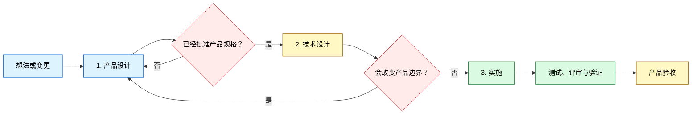

<div align="center">

# 🔥 GrillPowers

*先澄清，再严谨构建，最后用证据完成交付。*

[](../../LICENSE)


<table>
<tr><td align="left">
产品需求与技术需求被混在同一轮对话中。<br>
没有技术背景的用户被拉进难以判断的实现选择。<br>
每个技术分支都可能重新打开范围，需求越聊越大，难以收敛。
</td></tr>
</table>

**GrillPowers 把产品设计、技术设计与实施分开，让用户从想法到验收都专注于产品经理的职责。**

`想法 → 产品设计 → 技术设计 → 实施 → 验证 → 产品验收`

<a href="#why">初衷</a> ·
<a href="#install">安装</a> ·
<a href="#workflow">工作流</a> ·
<a href="#usage">使用</a> ·
<a href="#example">示例</a> ·
<a href="#structure">结构</a>

[**English**](../../README.md) · [**简体中文**](README_ZH.md)

</div>

---

<a id="why"></a>

## 🎯 为什么要做 GrillPowers

GrillPowers 的初衷很直接：把 Grill Me 与 Superpowers 中最有价值的方法缝合起来，取其精华，去其糟粕，为没有技术背景的产品经理提供一条从想法到验证交付的清晰路径。

- **Grill Me 提供产品聚焦能力。** 它先检查已有事实，一次只追问一个有意义的产品决策，给出推荐方向，并等待明确确认。
- **Superpowers 提供工程纪律。** 计划、测试驱动实施、系统化调试、评审归属和最新验证，让交付过程更可靠。

在面向产品经理的使用场景中，Superpowers 经常把产品需求与技术需求放进同一轮讨论。没有技术基础的用户会被架构选项和实现术语牵着走，难以判断自己正在做产品决策还是技术决策。每个新的技术可能性又会重新打开产品边界，需求越聊越大，逐渐失去收敛点。

GrillPowers 保留两者的优势，并建立三个明确的阶段边界：

| 痛点 | GrillPowers 的解决方案 | 优势 |
|---|---|---|
| 产品问题和技术问题混在一起讨论。 | 先完成并批准产品设计，再进入技术设计。 | 范围围绕产品价值和验收标准收敛。 |
| 用户被要求回答具体实现问题。 | 架构、数据、接口、测试和任务规划由智能体负责。 | 用户只需要当好产品经理。 |
| 技术可能性不断扩大需求范围。 | 技术选择一旦影响产品行为、范围、成本或风险，就返回产品设计阶段做明确决策。 | 技术工作无法静默扩大产品边界。 |

<a id="modes"></a>

## 🧩 选择安装方式

| 方式 | 适合场景 | 执行内容 |
|---|---|---|
| **托管式隔离安装** | 需要干净、可复现的配置 | 安装器按锁定提交获取两个上游，安装 GrillPowers 桥接技能，只公开精选技能。 |
| **手动集成** | 当前机器已经管理 Matt Pocock Skills 或 Superpowers | 保留现有上游目录，添加 `skills/grill-powers`，并按照 `config/skill-selection.json` 配置发现范围。 |

托管安装器会先执行预检；目标已存在时会停止。dry-run 会打印计划路径，安装器不会静默替换现有安装。

<a id="systems"></a>

## ✨ 三个阶段，用户只当产品经理

| 阶段 | 用户职责 | 智能体职责 | 退出条件 |
|---|---|---|---|
| **1. 产品设计** | 明确目标用户、产品价值、范围、业务规则和验收标准。 | 检查事实，一次追问一个产品决策，给出推荐方向，整理产品规格。 | 用户批准产品规格。 |
| **2. 技术设计** | 只处理会改变产品行为、范围、成本或风险的取舍。 | 把已批准产品转为架构、数据、接口、测试策略和实施计划。 | 技术设计覆盖所有验收标准，同时保持已批准产品边界。 |
| **3. 实施** | 检查可观察的产品结果，决定接受或拒绝。 | 编码、测试、调试、评审并运行最新验证。 | 证据支撑交付结果，用户完成产品验收。 |

用户只需要当好产品经理：决定做什么、为谁做、边界在哪里，以及怎样才算完成。GrillPowers 负责从已批准产品设计到验证实施的完整技术路径。

<a id="workflow"></a>

## 🗺 工作流



用户只参与产品设计与产品验收。技术设计和实施由智能体负责。技术发现一旦会改变已批准的产品边界，工作流立即暂停，把决定交还给产品经理。

<a id="managed"></a>

## 📦 GrillPowers 管理的内容

### 安装组件

- 一个原创编排技能：`skills/grill-powers`
- Matt Pocock Skills 固定在 `9603c1cc8118d08bc1b3bf34cf714f62178dea3b`
- Superpowers v6.1.1 固定在 `d884ae04edebef577e82ff7c4e143debd0bbec99`
- 一个面向用户的 GrillPowers 入口，底层使用经过筛选并锁定版本的上游方法

### 工作产物

- 一份包含可测试验收标准的已批准产品规格
- 一份可追溯到产品规格、由智能体负责的技术设计与实施计划
- 由一个交付负责人产出的代码和测试
- 评审结果、最新验证证据与产品验收

这些产物保存在用户项目中。本仓库只包含工作流定义、安装元数据和虚构示例。

<a id="install"></a>

## ⚡ 安装

### 要求

- Windows PowerShell 5.1 或更高版本
- Git
- Codex 通过本地 skills 目录发现技能

### 托管安装

先运行 dry-run：

```powershell
Set-ExecutionPolicy -Scope Process Bypass
.\scripts\install.ps1 -WhatIf
```

检查打印出的路径，然后安装并验证：

```powershell
.\scripts\install.ps1
.\scripts\verify.ps1
```

两个脚本都接受 `-InstallRoot` 与 `-DiscoveryRoot`，可用于隔离安装或测试。如果本地已有位于锁定提交、工作树干净的 checkout，安装器还接受 `-MattSourceRoot` 与 `-SuperpowersSourceRoot`。

### 手动集成

如果两个上游项目已经由其他系统安装并管理版本：

1. 把 `skills/grill-powers` 复制到宿主的技能目录。
2. 保持上游命名空间与完整技能目录。
3. 公开 `config/skill-selection.json` 中列出的入口。
4. 确认 `to-spec` 会交接给 `superpowers:writing-plans`。
5. 在宿主环境中运行技能验证器。

### 仓库回归测试

维护者可以准备两个位于锁定提交、工作树干净的 checkout，验证 dry-run、冲突拒绝、隔离安装、路由与篡改检测：

```powershell
.\scripts\test-install.ps1 `
  -MattSourceRoot C:\path\to\mattpocock-skills `
  -SuperpowersSourceRoot C:\path\to\superpowers
```

测试套件会在操作系统临时目录下创建唯一测试根目录，清理范围只包含该测试根目录。

<a id="usage"></a>

## 🚀 使用

从真实的产品想法、需求或变更开始：

```text
使用 $grill-powers，把「分享已保存搜索」从未解决的想法推进到经过验证的交付。
```

你会得到以下交互契约：

1. 用产品语言描述目标。
2. GrillPowers 检查已有事实，一次提出一个产品决策问题，并给出推荐方向。
3. 批准产品设计及其验收标准。
4. GrillPowers 完成技术设计与实施计划，只把会改变产品行为、范围、成本或风险的选择带回给你。
5. GrillPowers 完成编码、测试、调试、评审和验证。
6. 检查可观察的产品结果，完成产品验收。

整个过程中，你始终担任产品经理。GrillPowers 把你的产品决策保存为所有技术工作的契约。

<a id="principles"></a>

## 🛡 运行原则

1. **产品设计先行。** 技术可能性不能意外决定产品边界。
2. **一次处理一个产品决策。** 推荐方向让每个选择更容易理解和收敛。
3. **用户始终当产品经理。** 架构、数据、接口、测试和任务规划交给智能体。
4. **技术设计服从已批准产品。** 每项技术工作都要追溯到产品规则与验收标准。
5. **影响产品的变化必须回环。** 行为、范围、成本或风险变化需要明确的产品决策。
6. **实施以证据和验收结束。** 最新检查支撑技术结果，用户负责接受产品结果。

<a id="example"></a>

## 🎬 示例：分享已保存搜索

初始需求刻意保留了信息缺口：

> 让用户分享一个已保存搜索，我们需要尽快完成。

在产品设计阶段，GrillPowers 会解决真正改变产品的选择：

- 谁可以创建和打开链接？
- 访问是否要求登录？
- 所有者能否撤销链接？
- 链接是否过期？
- 无效链接或无权限访问者会看到什么？

用户批准这些答案后，GrillPowers 会冻结产品边界。进入技术设计阶段后，智能体选择数据模型、接口、权限检查、测试策略和实施计划。只有技术限制会改变产品体验、成本、风险或范围时，才会再次询问用户。进入实施阶段后，智能体完成构建和验证，用户检查最终产品行为。

查看完整的虚构产物链：

- [初始需求](../../examples/INPUT.md)
- [已批准规格](../../examples/SPEC.md)
- [实现计划](../../examples/IMPLEMENTATION-PLAN.md)
- [验证记录](../../examples/VERIFICATION.md)

<a id="structure"></a>

## 📂 项目结构

```text
grill-powers/
├── README.md
├── LICENSE
├── THIRD_PARTY_NOTICES.md
├── config/
│   ├── sources.lock.json
│   └── skill-selection.json
├── docs/
│   └── lang/
│       └── README_ZH.md
├── examples/
│   ├── INPUT.md
│   ├── SPEC.md
│   ├── IMPLEMENTATION-PLAN.md
│   └── VERIFICATION.md
├── LICENSES/
│   ├── mattpocock-skills-MIT.txt
│   └── superpowers-MIT.txt
├── scripts/
│   ├── install.ps1
│   ├── verify.ps1
│   └── test-install.ps1
└── skills/
    └── grill-powers/
        ├── SKILL.md
        ├── LICENSE
        ├── THIRD_PARTY_NOTICES.md
        ├── LICENSES/
        │   ├── mattpocock-skills-MIT.txt
        │   └── superpowers-MIT.txt
        ├── agents/
        │   └── openai.yaml
        └── references/
            └── handoff-contract.md
```

<a id="notes"></a>

## 📌 注意事项

- v1 提供经过测试的 Windows PowerShell 安装器；其他宿主可以选择手动集成。
- 来源提交与精选发现范围都保存在 `config/` 数据文件中，升级过程明确且便于审查。
- 两个上游项目保留自己的命名空间与完整目录结构。
- 安装器不会发布、推送、删除现有安装，也不会修改无关仓库。

<a id="credits"></a>

## 致谢与许可证

GrillPowers 是一个独立工作流集成项目，连接 [Matt Pocock Skills](https://github.com/mattpocock/skills) 与 [Jesse Vincent 的 Superpowers](https://github.com/obra/superpowers)。本项目与两个上游项目之间没有隶属或背书关系。

GrillPowers 原创内容采用 [MIT License](../../LICENSE)。上游声明和准确的许可证副本位于 [THIRD_PARTY_NOTICES.md](../../THIRD_PARTY_NOTICES.md) 与 [LICENSES](../../LICENSES)。

<div align="center">

**澄清决策，确认规格，用证据完成交付。**

</div>
