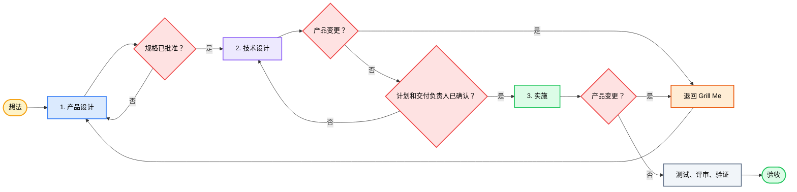

<div align="center">

# 🔥 GrillPowers

### *「先把产品想清楚，再把技术方案做扎实，最后用验证结果完成交付。」*

[](../../LICENSE)
[](https://agentskills.io)


[](https://github.com/okht/grill-powers)


<br>

<table>
<tr><td align="left">

🧑‍💼 &nbsp;产品需求和技术方案经常混在同一轮对话里。<br>
🧩 &nbsp;没有工程背景的人，也会被推着回答自己很难判断的实现问题。<br>
📈 &nbsp;技术选项越聊越多，产品范围随之扩大，需求迟迟无法收敛。

</td></tr>
</table>

### ✨ GrillPowers 让你从想法到验收，都能专注于产品经理的工作。

<br>

GrillPowers 结合 **[Grill Me](https://github.com/mattpocock/skills)** 和 **[Superpowers](https://github.com/obra/superpowers)**，并把整个工作流清楚地分成三个阶段。

**Grill Me** — 一次确认一个产品决策 · **Superpowers** — 计划、TDD、评审、最新验证

**想法 → 产品设计 → 技术设计 → 实施 → 验证 → 验收**

<br>

[🎯 为什么](#-为什么) · [✨ 阶段](#-阶段) · [🗺 流程](#-流程) · [🔁 范围变了](#-产品范围发生变化时) · [📦 你会得到什么](#-你会得到什么) · [⚡ 安装](#-安装) · [🚀 使用](#-使用) · [✨ 示例](#-示例)

[**English**](../../README.md) · [**简体中文**](README_ZH.md)

</div>

---

<div align="center">

基于 [Matt Pocock Skills](https://github.com/mattpocock/skills) · [Jesse Vincent Superpowers](https://github.com/obra/superpowers) · [@okht](https://github.com/okht)

</div>

---

## 🎯 为什么

### 1️⃣ 两个上游的强项

<table>
<thead>
<tr>
<th width="50%" align="center">🔥 Grill Me</th>
<th width="50%" align="center">⚡ Superpowers</th>
</tr>
</thead>
<tbody>
<tr>
<td align="center"><sub>产品澄清</sub></td>
<td align="center"><sub>工程交付</sub></td>
</tr>
<tr>
<td><sub>一次只讨论一个产品决策，给出明确选项和推荐方向，等待用户确认。</sub></td>
<td><sub>通过计划、测试、调试、评审和最新验证，让实施过程更可靠。</sub></td>
</tr>
</tbody>
</table>

### 2️⃣ 为什么还需要 GrillPowers

我做 GrillPowers 的初衷很简单：保留 Grill Me 最擅长的产品澄清能力，也保留 Superpowers 扎实的工程方法，再去掉容易让非技术用户陷入实现细节、让需求不断膨胀的部分。简单说，就是取其精华，去其糟粕。

Superpowers 的工作流经常把「产品要做什么」和「技术要怎么做」放在同一轮里讨论。没有技术基础的人会被架构、接口、数据模型和测试方案牵着走，却很难判断这些选择。每多出一个技术选项，已经收拢的产品范围就可能再次扩大，需求越聊越多，最后很难收口。

GrillPowers 因此把产品设计、技术设计和实施明确分开。用户始终负责产品判断，具体的技术工作交给智能体。

| 问题 | GrillPowers 怎么做 |
|---|---|
| 🧑‍💼 产品问题和技术问题混在一起 | 先确认产品设计，再进入技术设计 |
| 🧩 用户被要求回答实现问题 | 架构、数据、接口、测试和任务规划都交给智能体 |
| 📈 技术选项不断扩大产品范围 | 实施期间出现实质性的产品变化时，先退回 Grill Me，再依次更新共识、规格和计划 |

---

## ✨ 阶段

<table>
<thead>
<tr>
<th width="33%" align="center">1️⃣ 产品设计</th>
<th width="33%" align="center">2️⃣ 技术设计</th>
<th width="33%" align="center">3️⃣ 实施</th>
</tr>
</thead>
<tbody>
<tr>
<td align="center"><sub>你明确目标用户、产品价值、范围、规则和验收标准</sub></td>
<td align="center"><sub>你只决定会影响产品行为、范围、成本或风险的取舍</sub></td>
<td align="center"><sub>你查看实际呈现的结果，决定是否验收</sub></td>
</tr>
<tr>
<td><sub>智能体查看已有信息，一次确认一个产品决策，给出建议并整理产品规格。</sub></td>
<td><sub>智能体把确认后的产品规格转成架构、数据、接口、测试和实施计划。</sub></td>
<td><sub>智能体负责编码、测试、调试、评审和最新验证。</sub></td>
</tr>
<tr>
<td align="center"><sub><b>完成：</b>你确认产品规格</sub></td>
<td align="center"><sub><b>完成：</b>技术设计覆盖所有验收标准，你确认实施计划和交付负责人</sub></td>
<td align="center"><sub><b>完成：</b>最新验证通过，你完成产品验收</sub></td>
</tr>
</tbody>
</table>

你只需要做好产品经理：决定做什么、为谁做、边界在哪里，以及怎样才算完成。产品规格确认后，GrillPowers 会负责技术设计和实施；开始实施前，它会汇报计划摘要并推荐一名交付负责人，等你确认后再继续。

---

## 🗺 流程



你主要参与产品设计和最终验收，技术设计和实施由智能体负责。如果后续发现会改变产品边界的问题，受影响的工作会先暂停，再按下一节的流程回到产品阶段；不受影响的工作仍可继续。

---

## 🔁 产品范围发生变化时

技术设计或实施过程中，可能会发现产品规格没有明确写出的关键问题，例如权限边界、会改变原有承诺的低成本方案、对同一条验收标准的不同理解，或因成本限制需要缩小范围。

遇到这类情况，智能体不能一边编码一边自行扩大产品，也不能为了继续推进而替用户做产品取舍。任何实质性的产品变化，都需要先回到产品阶段重新确认。

### 1️⃣ 暂停 → Grill Me → 重新确认 → 恢复

1. **暂停**受这个问题影响的技术工作，不受影响的工作可以继续。
2. **退回 Grill Me。** 一次只处理一个产品决策，并给出推荐方向。
3. **依次更新并确认：** 产品共识 → `to-spec` 产品规格 → `superpowers:writing-plans` 实施计划。
4. **按照新确认的产品边界恢复实施。**

```text
设计或代码里发现产品变更
        │
        ▼
   暂停受影响工作
        │
        ▼
   Grill Me
        │
        ▼
   确认共识 → 更新并确认规格
        │
        ▼
   更新计划 → 恢复实施
```

### 2️⃣ 哪些变化需要回到产品阶段

| 信号 | 动作 |
|---|---|
| 🔴 改变用户可见行为、核心流程、范围、验收标准、业务规则、权限、隐私、计费、数据含义或不可逆操作 | 暂停，并从 Grill Me 开始走完产品确认流程 |
| 🔴 产品规格存在两种合理理解 | 作为尚未解决的产品决策处理 |
| 🔴 因实现困难而降低或替换已经承诺的需求 | 交回用户做产品决策，实施阶段不能自行改写承诺 |
| 🟢 文件布局、接口、数据结构、测试、`mock` 或缺陷修复，且完整保留已经确认的范围、行为、验收标准、业务规则、约束和风险边界 | 继续留在 Superpowers 的实施流程中 |
| 🟡 明确且低风险的用户可见微调 | 用户明确确认并记录产品规格的小幅修订后，可以留在实施流程中 |

回到 Grill Me 后，还需要继续更新产品规格和实施计划。完整走完 `grilling → 确认 → to-spec → writing-plans`，才能让规格、计划、测试和代码重新对齐到同一条已经确认的产品边界。

---

## 📦 你会得到什么

### 安装到本机的内容

- 一个编排 Skill：`skills/grill-powers`
- 锁定在 `9603c1cc8118d08bc1b3bf34cf714f62178dea3b` 的 Matt Pocock Skills
- 锁定在 `d884ae04edebef577e82ff7c4e143debd0bbec99` 的 Superpowers v6.1.1
- 一个面向用户的 GrillPowers 入口，底层调用固定版本的上游 Skill

### 工作产物

| 产物 | 作用 |
|---|---|
| ✅ 已确认的产品规格 | 包含可测试的验收标准 |
| 🧭 技术设计与实施计划 | 由智能体负责，可以追溯到产品规格 |
| 💻 代码与测试 | 由一名交付负责人统一推进 |
| 🧪 评审、验证与验收 | 提供最新验证证据，最终产品结果由你验收 |

本仓库只包含工作流、安装信息和虚构示例。实际产生的产品规格、计划、代码和验证记录都保存在你的项目里。

---

## ⚡ 安装

既然你已经在使用智能体，可以直接让它完成安装。打开 Codex 或其他支持安装 Skill 的宿主，把下面这句话发给它：

> 帮我安装 GrillPowers skill：`https://github.com/okht/grill-powers`

智能体会克隆仓库，把 `skills/grill-powers` 放进宿主能够发现的 skills 目录，并在需要时运行安装脚本，获取锁定版本的 Grill Me 和 Superpowers。安装完成后，使用 `$grill-powers` 启动。

<details>
<summary><b>🛠️ 想手动安装？点开查看脚本和路径</b></summary>

<br>

需要 Windows PowerShell 5.1+、Git，以及 Codex 用的本地 skills 目录。

| 方式 | 何时用 | 做什么 |
|---|---|---|
| 托管式安装 | 首次安装或希望环境可复现 | 按锁定提交下载两个上游，安装 GrillPowers 编排 Skill，只向 Codex 暴露选定的 Skill |
| 手动接入 | 本机已经安装并管理 Matt Pocock Skills 或 Superpowers | 保留现有目录，添加 `skills/grill-powers`，并按照 `config/skill-selection.json` 配置发现范围 |

```powershell
Set-ExecutionPolicy -Scope Process Bypass
.\scripts\install.ps1 -WhatIf
.\scripts\install.ps1
.\scripts\verify.ps1
```

脚本支持 `-InstallRoot` 和 `-DiscoveryRoot`。如果本地已有提交与锁定版本一致、工作树干净的检出，可以通过 `-MattSourceRoot` 和 `-SuperpowersSourceRoot` 直接使用。安装器会先做预检；目标目录已经存在时会停止，也不会在没有提示的情况下覆盖现有安装。

**手动接入步骤**（两个上游已经由其他工具管理版本时）：

1. 把 `skills/grill-powers` 复制到宿主的 Skill 目录。
2. 保留上游原有的命名空间和完整 Skill 目录。
3. 向 Codex 暴露 `config/skill-selection.json` 中列出的入口。
4. 确认 `to-spec` 能够交接给 `superpowers:writing-plans`。
5. 在宿主环境中运行 Skill 检查。

**维护者测试**（需要两个提交与锁定版本一致、工作树干净的本地检出）：

```powershell
.\scripts\test-install.ps1 `
  -MattSourceRoot C:\path\to\mattpocock-skills `
  -SuperpowersSourceRoot C:\path\to\superpowers
```

</details>

---

## 🚀 使用

直接从一个真实的产品想法开始：

```text
使用 $grill-powers，把「分享已保存搜索」从一个还没想清楚的想法推进到经过验证的交付。
```

### 🎛️ 交互约定

1. 你用产品语言说清楚想做什么。
2. GrillPowers 查看已有信息，一次只问一个产品问题，并给出推荐方向。
3. 你确认产品设计和验收标准。
4. GrillPowers 完成技术设计和实施计划。只有会影响产品行为、范围、成本或风险的选择，才会交回给你决定。
5. GrillPowers 汇报计划摘要并推荐一名交付负责人；你确认计划和负责人后，实施才会开始。
6. GrillPowers 完成编码、测试、调试、评审和验证。
7. 你查看实际呈现的产品结果，完成最终验收。

你确认的产品决策会写进产品规格，并成为后续所有技术工作的共同依据。

### 🛡 智能体遵守的规则

1. **先定产品，再谈技术。** 技术选项不能擅自改变产品边界。
2. **一次只处理一个产品决策。** 每个问题都会附带推荐方向，让讨论更容易理解和收敛。
3. **你专注产品。** 架构、数据、接口、测试和任务规划都交给智能体。
4. **技术设计以产品规格为准。** 每项技术工作都要能追溯到已经确认的产品规则和验收标准。
5. **影响产品的变化必须回到产品阶段。** 暂停受影响的工作，重新确认产品规格并更新计划后再继续。
6. **实施以验证和验收收尾。** 最新验证为技术完成结论提供证据，最终产品结果由你验收。

---

## ✨ 示例

起始请求（故意不完整）：

> 让用户分享一个已保存搜索。我们需要尽快完成。

产品设计阶段需要先确认这些真正影响产品的问题：

- 谁可以创建和打开链接？
- 访问要不要账号？
- 所有者能否撤销？
- 会不会过期？
- 无效或无权访问者看到什么？

你确认答案后，GrillPowers 会把当前产品边界写进产品规格。进入技术设计阶段后，智能体会决定数据模型、接口、权限检查、测试策略和实施计划。只有当技术限制会改变产品体验、成本、风险或范围时，相关问题才会再次交回给你。计划和交付负责人确认后，智能体开始实施并完成验证，最后由你验收实际的产品结果。

| 步骤 | 产物 |
|------|------|
| 1️⃣ | [初始请求](../../examples/INPUT.md) |
| 2️⃣ | [已批准规格](../../examples/SPEC.md) |
| 3️⃣ | [实施计划](../../examples/IMPLEMENTATION-PLAN.md) |
| 4️⃣ | [验证记录](../../examples/VERIFICATION.md) |

> ⚠️ **关于本示例** — 这些文件均为虚构内容，只用于展示各阶段的产物形式，不代表真实的功能设计。

---

## 📂 项目结构

```text
grill-powers/
├── README.md
├── LICENSE
├── THIRD_PARTY_NOTICES.md
├── config/
│   ├── sources.lock.json          # 锁定的上游提交
│   └── skill-selection.json       # 发现范围
├── docs/lang/README_ZH.md
├── examples/
│   ├── INPUT.md
│   ├── SPEC.md
│   ├── IMPLEMENTATION-PLAN.md
│   └── VERIFICATION.md
├── LICENSES/
├── scripts/
│   ├── install.ps1
│   ├── verify.ps1
│   └── test-install.ps1
└── skills/grill-powers/
    ├── SKILL.md
    ├── agents/openai.yaml
    └── references/handoff-contract.md
```

---

## ⚠️ 其他说明

- v1 提供经过测试的 Windows PowerShell 安装器，其他宿主可以选择手动接入。
- 锁定的上游提交和 Skill 列表都记录在 `config/` 中，升级时需要明确修改。
- 两个上游项目会保留各自的命名空间和完整目录结构。
- 安装器不会发布或推送任何内容，也不会删除现有安装或修改无关仓库。

---

## 📄 致谢与许可证

GrillPowers 是一个独立的工作流编排项目，整合了 [Matt Pocock Skills](https://github.com/mattpocock/skills) 和 [Jesse Vincent Superpowers](https://github.com/obra/superpowers)。本项目与两个上游项目没有隶属关系，也不代表它们为本项目背书。

GrillPowers 的原创内容采用 [MIT License](../../LICENSE)。上游声明和完整的许可证副本请查看 [THIRD_PARTY_NOTICES.md](../../THIRD_PARTY_NOTICES.md) 和 [LICENSES](../../LICENSES)。

---

<div align="center">

**MIT License** © [okht](https://github.com/okht)

</div>
